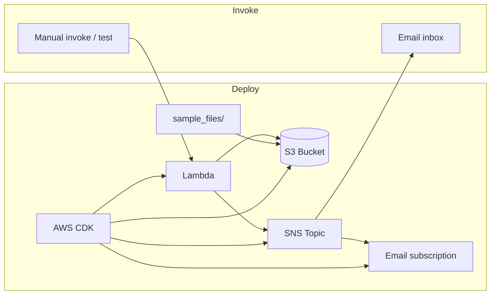
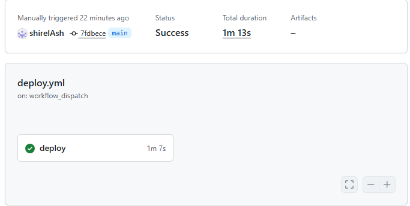
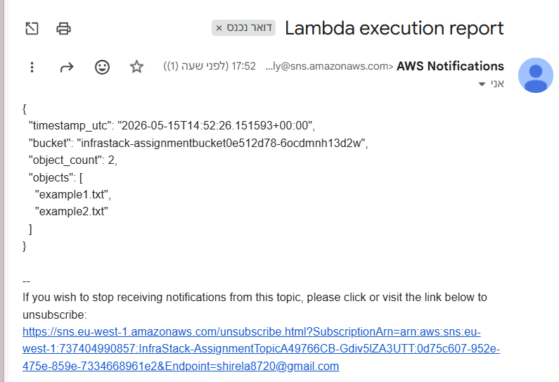

# DevOps Serverless Assignment

A fully automated serverless application on AWS: a Lambda function lists objects in an S3 bucket and publishes execution details to an SNS topic (email). Infrastructure is defined with **AWS CDK (Python)** and deployed via **GitHub Actions** or locally.

## Architecture



## Tools and frameworks

| Tool | Purpose |
|------|---------|
| [AWS CDK](https://aws.amazon.com/cdk/) (Python) | Infrastructure as Code |
| Python 3.11 | Lambda runtime |
| Amazon S3 | Object storage |
| Amazon SNS | Email notifications |
| AWS Lambda | Serverless compute |
| GitHub Actions | CI/CD (`workflow_dispatch`) |
| AWS CLI | Manual Lambda invoke |

## Project layout

```
├── infra/                 # CDK app (stack, deploy config)
├── lambda/                # Lambda handler (app.py)
├── sample_files/          # Files uploaded to S3 on deploy
├── scripts/               # Manual test scripts
├── docs/screenshots/      # Verification screenshots
├── .github/workflows/     # GitHub Actions deploy workflow
└── README.md
```

## Prerequisites

- AWS account with permissions to deploy CDK stacks (S3, Lambda, SNS, IAM, CloudFormation)
- [AWS CLI](https://aws.amazon.com/cli/) configured (`aws configure` or environment variables)
- Python 3.11+ and Node.js (for CDK CLI)
- For local deploy: `pip install -r infra/requirements.txt` and `npm install -g aws-cdk`

## Setup and deployment

### 1. Clone the repository

```bash
git clone https://github.com/shirelAsh/devops-serverless-assignment.git
cd devops-serverless-assignment
```

### 2. Deploy locally with CDK

```bash
cd infra
python -m venv .venv
# Windows: .venv\Scripts\activate
# macOS/Linux: source .venv/bin/activate
pip install -r requirements.txt
cdk deploy -c email="you@example.com" --require-approval never
```

Replace `you@example.com` with the address that should receive SNS notifications.

On success, CDK prints stack outputs:

- **BucketName** — S3 bucket (includes `sample_files/` content after deploy)
- **LambdaName** — function name for manual testing
- **TopicArn** — SNS topic ARN

### 3. Confirm SNS email subscription (required once)

After the first deployment, AWS sends a **subscription confirmation** email to the address you passed with `-c email=...`.

1. Open the email from AWS Notifications (`no-reply@sns.amazonaws.com`).
2. Click **Confirm subscription**.

Until you confirm, Lambda runs succeed but **no email is delivered**.

**Verify subscription status** (optional):

```bash
aws sns list-subscriptions-by-topic \
  --topic-arn "<TopicArn from stack output>"

aws sns get-subscription-attributes \
  --subscription-arn "<SubscriptionArn from above>"
```

Look for `"PendingConfirmation": "false"` in the attributes.

### 4. Deploy with GitHub Actions

1. In the GitHub repository, add **Secrets** (Settings → Secrets and variables → Actions):
   - `AWS_ACCESS_KEY_ID`
   - `AWS_SECRET_ACCESS_KEY`
   - `AWS_REGION` (e.g. `eu-west-1`)
   - `NOTIFICATION_EMAIL` — same email used for SNS subscription
2. Open **Actions** → **Deploy (CDK)** → **Run workflow**.

The workflow runs `cdk deploy` with `-c email=${{ secrets.NOTIFICATION_EMAIL }}`. Confirm the SNS email after the first Actions deploy as well.

## Manual Lambda test

Invoke the function after deploy (and after confirming SNS if you want email).

### PowerShell (Windows)

From the repository root:

```powershell
.\scripts\invoke_lambda.ps1 -FunctionName "<LambdaName from CDK output>"
```

Optional: write output to a file (default `response.json`):

```powershell
.\scripts\invoke_lambda.ps1 -FunctionName "InfraStack-AssignmentLambda6D527E76-XXXXXXXX" -OutFile "response.json"
```

### AWS CLI (any OS)

```bash
aws lambda invoke \
  --function-name "<LambdaName>" \
  --cli-binary-format raw-in-base64-out \
  --payload '{}' \
  response.json

cat response.json
```

### Get the function name after deploy

```bash
aws cloudformation describe-stacks \
  --stack-name InfraStack \
  --query "Stacks[0].Outputs[?OutputKey=='LambdaName'].OutputValue" \
  --output text
```

### Expected results

**CLI / `response.json`** — HTTP 200 with a body similar to:

```json
{
  "statusCode": 200,
  "body": "{\"timestamp_utc\": \"...\", \"bucket\": \"...\", \"object_count\": 2, \"objects\": [\"example1.txt\", \"example2.txt\"]}"
}
```

**Email** — Subject `Lambda execution report`, message body JSON with bucket name, object count, and object keys.

**S3** — Bucket contains `example1.txt` and `example2.txt` from `sample_files/` (uploaded during `cdk deploy` via `BucketDeployment`).

## Verification screenshots

### GitHub Actions deploy (CI/CD)

Manual `workflow_dispatch` run — stack `InfraStack` deployed successfully via CDK.



### SNS notification (manual Lambda invoke)

Email received after invoking the Lambda (subject: `Lambda execution report`).



## IAM permissions

The Lambda execution role is created by CDK with least-privilege grants:

- **S3** — read on the assignment bucket only (`bucket.grant_read`)
- **SNS** — publish to the assignment topic only (`topic.grant_publish`)
- **Lambda** — standard execution (logs, etc.)

## Running unit tests

```bash
cd infra
pip install -r requirements-dev.txt
pytest
```

## Troubleshooting

| Issue | What to check |
|-------|----------------|
| No email after invoke | SNS subscription confirmed? `PendingConfirmation` must be `false`. |
| `cdk deploy` fails on email | Pass context: `-c email="you@example.com"`. |
| Empty object list | Redeploy so `BucketDeployment` runs; check bucket name in Lambda env matches stack bucket. |
| GitHub Actions deploy fails | Repository secrets set; IAM user can run CDK deploy. |

## License

Technical interview take-home assignment. All rights reserved.
